# Kasumi 的数字小屋 · 个人博客全景功能与架构档案

> 静谧、纯粹、反模板化 —— 基于 Next.js 16 与侘寂美学的数字创作空间与掌机游乐场。

---

## 📖 项目简介

**Kasumi 的数字小屋**（Kasumi's Digital Cottage）是一个以「沉静阅读、光影记录、复古灵感」为核心理念的现代化个人全栈博客。不同于常见的模板化 SaaS 仪表盘或喧闹的科技资讯站，本项目遵循东方侘寂（Wabi-Sabi）哲学与编辑部排版风格，融合了现代 Next.js 16 架构与复古掌机交互，为文字随笔、数字画廊与算法小游戏提供了一处高度自洽的栖息地。

### 🌟 核心设计准则

- **自然温润的色彩体系**：主色调选用深松绿（`#36513B`）、砂岩暖白（`#FAF7F2`）与苔原绿（`#7CD090`），配合深色模式下的极简暗夜深松色（`#16231A`）。
- **严格零 Emoji 规范**：全站坚决杜绝任何原生 Emoji 表情，全面采用精致的排版字重层级、物理硬件符号（如 `[ L1 ]`、`▶`）与 Lucide 线性矢量图标，保持专业、冷峻且优雅的高级质感。
- **悬浮拟物与硬件微动效**：悬浮毛玻璃胶囊导航、一体化实体掌机十字方向键、CRT 屏幕微弱噪点、Web Audio 8-bit 程序化无损音效。

---

## 🖼️ 核心功能与页面全景深度解析（含全量实机截图）

---

### 1. 首页：全屏平滑滑动轨道与多模块聚合 (`/`)

首页采用纯 CSS 3D Translation 驱动的整页平滑滑动轨道（`FullpageSlider`），告别生硬的吸附式滚动，呈现杂志翻页般的流畅体验。

#### 1.1 电影级暗调摄影 Hero
- **大画幅沉浸首屏**：结合高清晰度摄影背景与呼吸式暗角光影；
- **TextType 打字机标语**：循环展示诗意与技术信条，彰显个人品牌表达；
- **悬浮胶囊导航 (Floating Nav)**：居中微毛玻璃浮动胶囊，支持当前路由高亮与全局快速跳转。

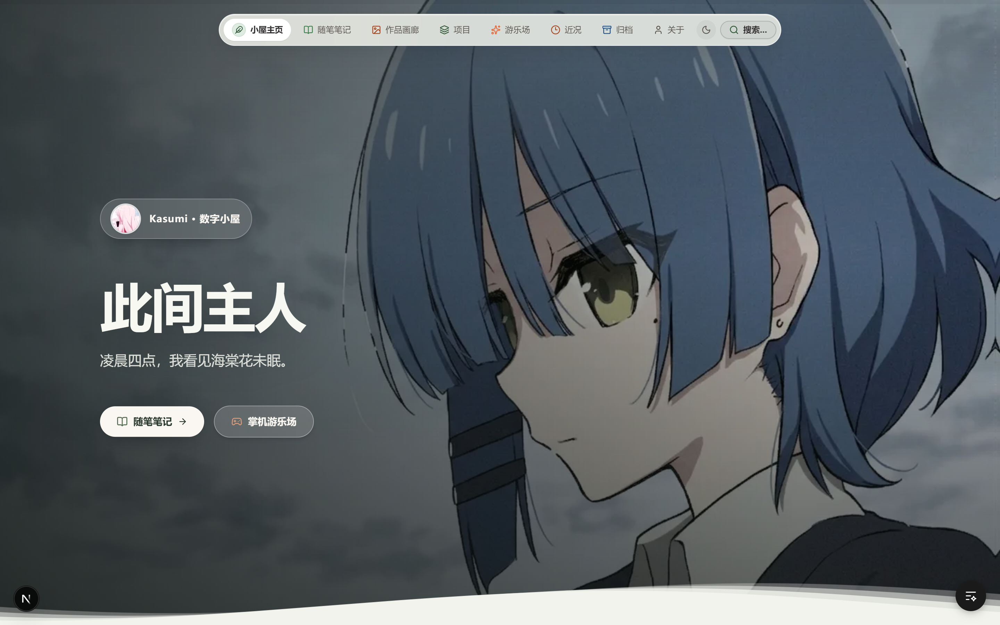

#### 1.2 首页精选随笔分栏
- 精选聚合近期技术实践与深度思考文章；
- 卡片采用微阴影与温润纸质底色，悬停时微浮动交互。

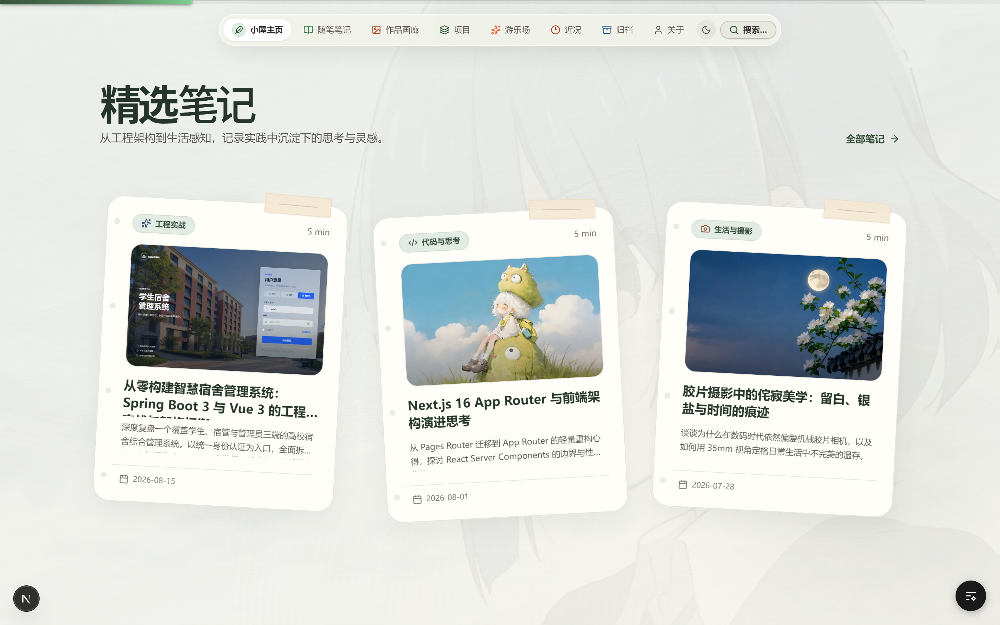

#### 1.3 首页作品画廊展台
- 展示最新摄影与插画作品，以错落卡片形式呈现视觉张力；
- 点击直达画廊大图。


#### 1.4 首页精选工程案例
- 呈现代表性全栈工程案例（如高校智慧宿舍管理系统）；
- 标明技术栈标签与开发进展。


#### 1.5 首页掌机街机开机待机舞台
- 首页底部分栏内嵌掌机开机画面，提供街机投币霓虹大标与 `▶ PUSH [START] TO PLAY` 脉冲按钮；
- 点击直接唤醒掌机并带参（`?start=true`）无缝跳转至游乐场游戏选卡主界面。

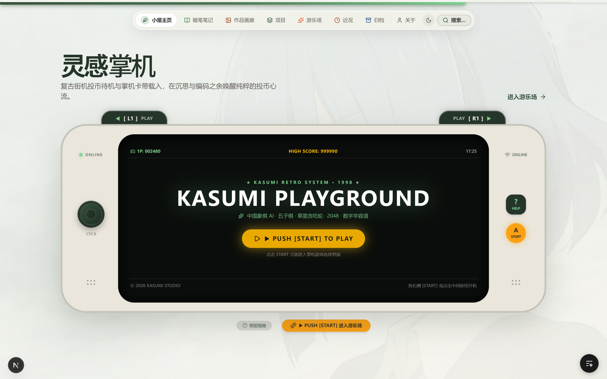

---

### 2. 随笔笔记系统 (`/notes`, `/notes/[id]`)

随笔模块是博客的核心思想记录地，专为长文深度阅读与技术复盘量身定制。

#### 2.1 随笔笔记列表页 (`/notes`)
- **本地 Markdown / Frontmatter 极速解析**：文章数据完全由本地 Markdown 驱动，零多余网络开销；
- **四维分类过滤胶囊**：支持「全部」、「工程实战」、「代码与思考」、「生活与摄影」、「前端与设计」一键过滤；
- **实时模糊搜索框**：输入关键词即可毫秒级匹配标题与摘要，并实时更新文章计数统计。


#### 2.2 随笔笔记深度长文阅读页 (`/notes/[id]`)
- **自动提取目录导航 (TOC)**：随滚动高亮当前阅读章节；
- **字数统计与阅读时长估算**：提供清晰的时间预期；
- **专业代码高亮与排版**：支持多语言语法高亮、复制按钮与行内代码样式。


---

### 3. 作品画廊系统 (`/gallery`)

画廊是视觉作品、摄影光影与动漫插画的沉浸式流式空间。

#### 3.1 3 列错落流式瀑布流 (`/gallery`)
- 保持每张图片的原始自然比例，拒绝机械的 16:9 硬裁切；
- 首屏顶部巧妙露出一小截下一行图片，自然引导访客向下探索。


#### 3.2 100% ~ 300% 交互式平滑缩放查看器
- 点开任意作品即可唤起轻量纸质感大图详情窗（支持键盘 `Esc` 关闭、`←` / `→` 切换上一张/下一张）；
- **平滑缩放与拖拽**：支持滚轮或手势以半级步进无损放大、平移视口查看细节；
- **URL 深度直达**：支持 `/gallery?work=<photoId>` 链接，在社交平台分享时精准定位。

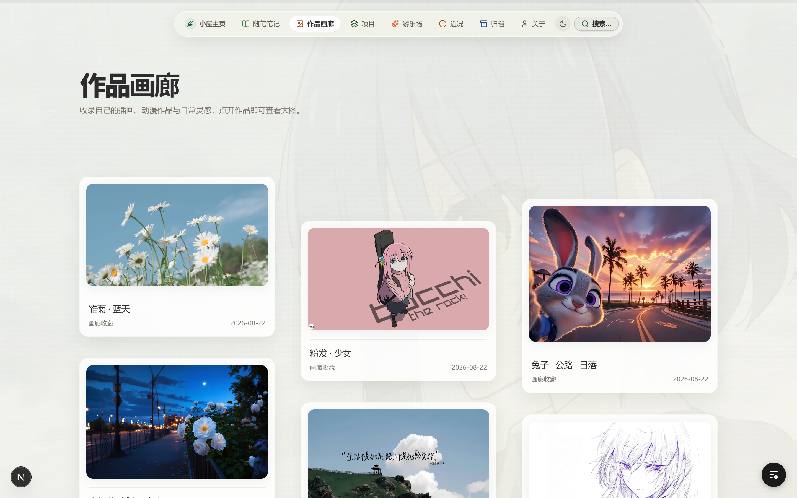

---

### 4. 灵感掌机与复古街机游乐场 (`/playground`)

游乐场是本博客最具特色、最富趣味的独立交互模块，将复古掌机硬件质感与现代 Web 交互完美结合。

#### 4.1 掌机实体机身外观设计
- **经典双握把工学外壳**：温润砂岩质感面板（`#EAE6DC` / `#16231A`）搭配深松绿倒角边框；
- **顶部凸起双肩键（L1 / R1）**：支持快速向前/向后切换游戏；
- **左侧握把区**：呼吸状态 LED 指示灯、全新设计的**一体化实体凹槽十字键（D-PAD）**（上/左为上选，下/右为下选，支持键盘 `WASD` / `方向键` 同步操控）；
- **右侧握把区**：网络状态标签、实体 `[ ? ] HELP` 指南键与 `(A) START` 确认启动键；
- **底部实体胶囊栏**：提供帮助指南呼出、一键启动与重置待机功能。

#### 4.2 待机锁屏模式（Attract Mode）
- 街机经典 HUD 高分榜（`1P: 002480` / `HIGH SCORE: 999990`）；
- 霓虹待机大标 `★ CLOUD ARCADE SYSTEM 1998 ★` 与呼吸发光开机按钮；
- 从普通路由直接访问 `/playground` 时自动保持待机锁屏，极具仪式感。

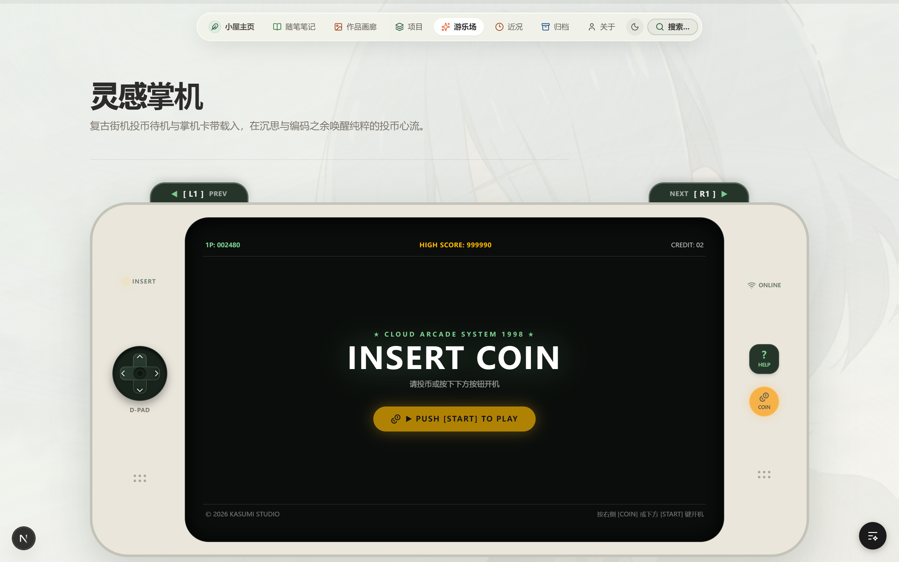

#### 4.3 游戏机运行与选卡模式（Console OS）
- 从主页点击 `START` 时自动带参（`?start=true`）无缝开机直达；
- **上半部分（左右分栏）**：左侧为舒展工整的游戏库菜单列表（高亮选中项、`▶ READY` 待命指示灯），右侧为大幅高清游戏封面海报；
- **下半部分（精炼介绍区）**：清晰陈列游戏玩法分类、开发方、玩家人数与操作指引，内嵌快速启动按钮 `(A) 启动游戏`。

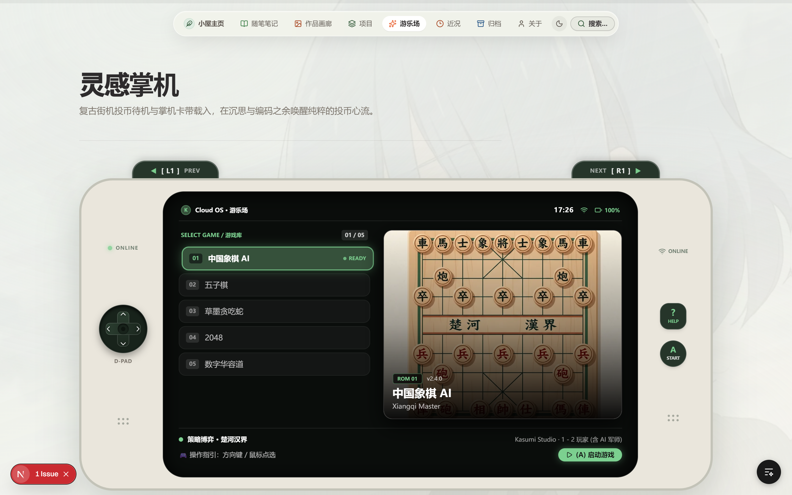

#### 4.4 5 款内置原创独立小游戏实机运行

##### 4.4.1 中国象棋 AI
- **核心算法**：Minimax + Alpha-Beta 剪枝智能 AI 博弈算法、合法走法生成引擎；
- **玩法特色**：经典楚河汉界棋盘，支持单人挑战 AI 军师与本地双人推演，具备走棋音效与将军警示。

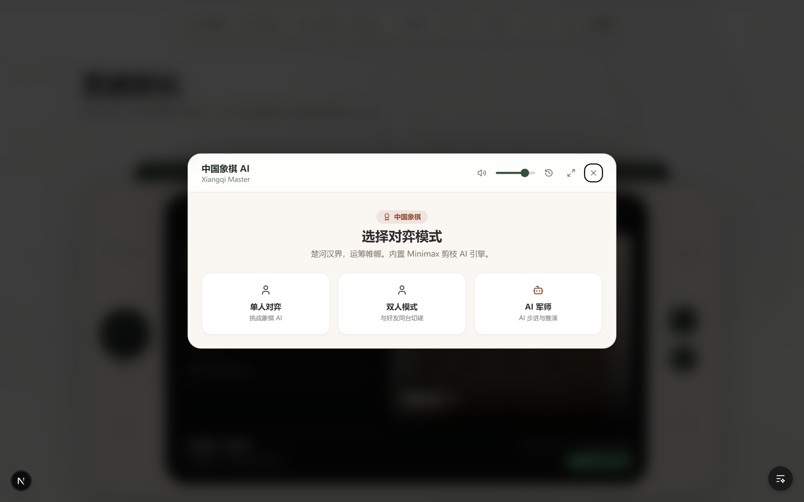

##### 4.4.2 五子棋对弈
- **核心算法**：连珠权值评估矩阵与胜负判定；
- **玩法特色**：极简纯净木纹棋盘，落子声效，支持悔棋与先手切换。

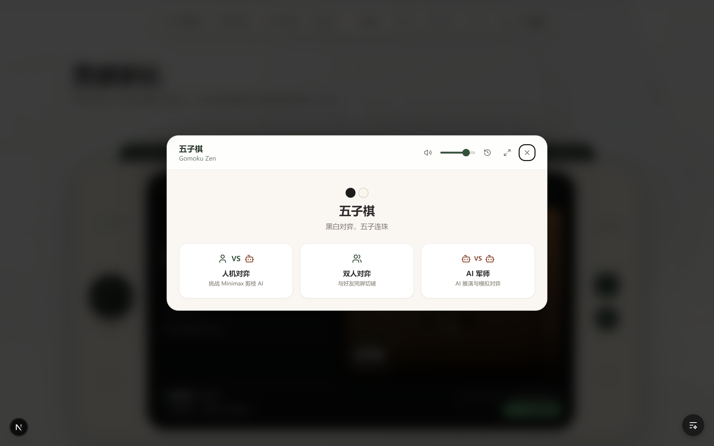

##### 4.4.3 草墨贪吃蛇
- **核心算法**：HTML5 Canvas 极简渲染、自适应 ResizeObserver 容器尺寸；
- **玩法特色**：随进食平滑提速机制，死亡时平滑展现结算遮罩与最高分记录。

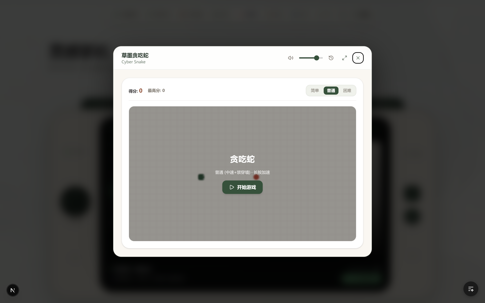

##### 4.4.4 2048 数字合并
- **核心算法**：CSS Grid 弹性位移、物理缩放弹跳动画；
- **玩法特色**：极简配色方块，高分持久化存储，流畅连击消除反馈。

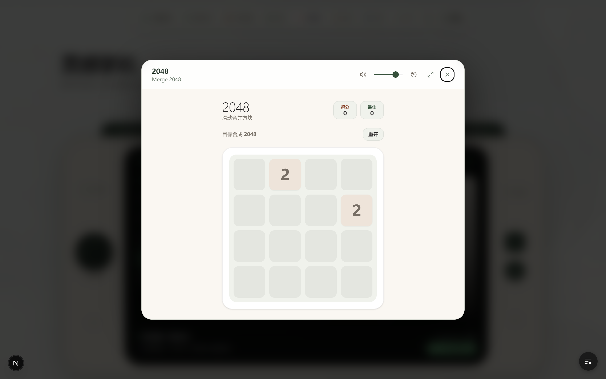

##### 4.4.5 数字华容道拼图
- **核心算法**：逆序数奇偶可解性洗牌算法，确保每次打乱必定有解；
- **玩法特色**：绝对定位平滑位移过渡，实时移动步数计数器与毫秒级秒表。

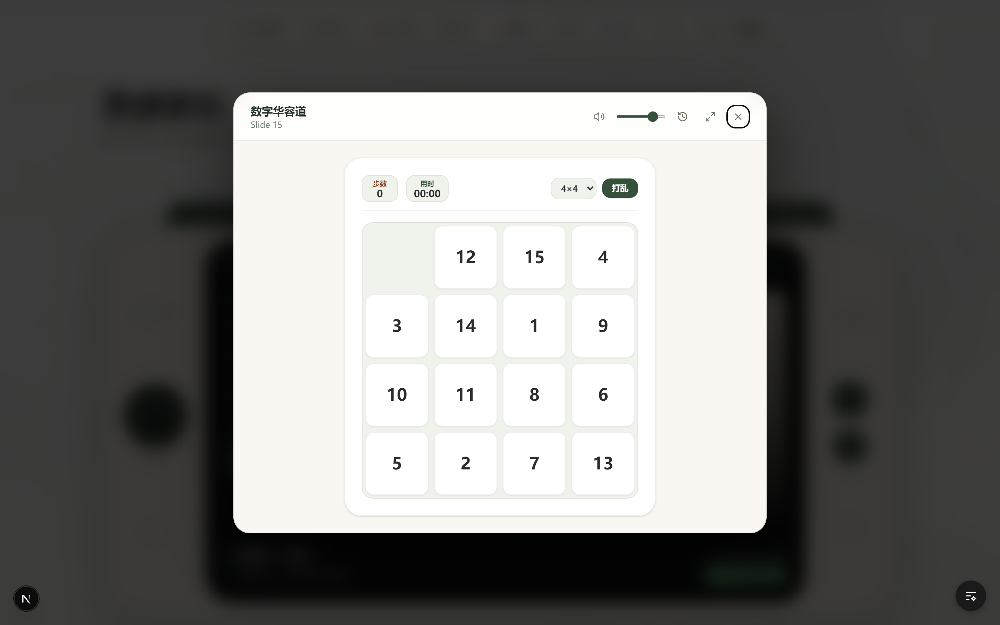

#### 4.5 Web Audio 8-bit 程序化音效引擎
全站小游戏音效均采用原生 Web Audio API **实时纯代码合成无损 PCM WAV 音频**，零外部音频文件网络开销：
- 投币启动音效（Coin Insert）
- 卡带切换选卡音效（Cartridge Move）
- 棋子落盘/方块移动触觉声（Piece Click）
- 消除得分与胜利欢呼（Victory Chime）

---

### 5. 项目工程实战档案 (`/projects`)

收录站长的全栈开发实战项目，包含深度架构剖析、技术选型演进与真实系统交互演示。

#### 5.1 项目档案列表 (`/projects`)
- 杂志卡片化展示工程全貌、开发状态、技术标签与 GitHub 源码链接。

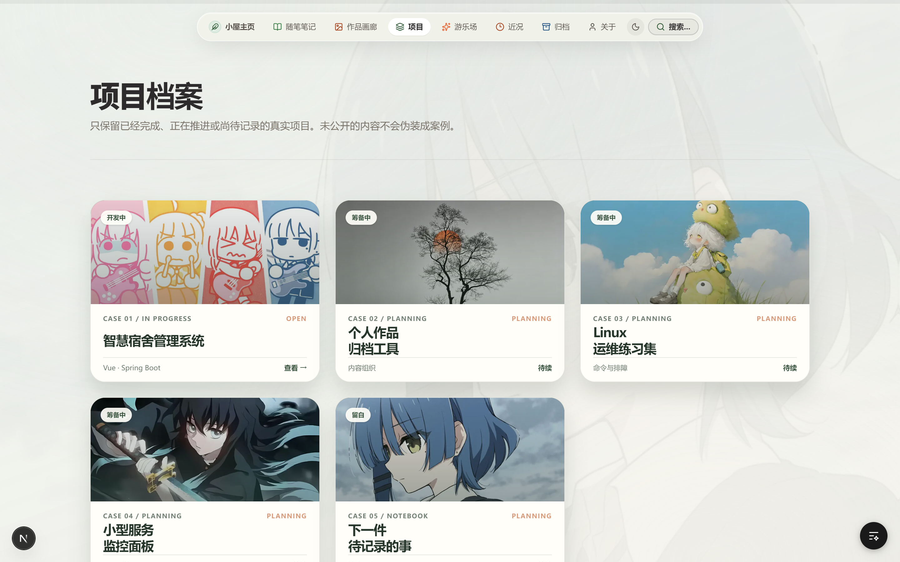

#### 5.2 高校智慧宿舍管理系统案例详情 (`/projects/dormitory-system`)
- 基于 Next.js + Tailwind + Node.js + MySQL 构建的多角色宿舍中枢；
- 深度展示学生端报修/查房、宿管端出入审核、管理员端全景房源大屏与可视化统计；
- 配备完整的系统运行真实截图。

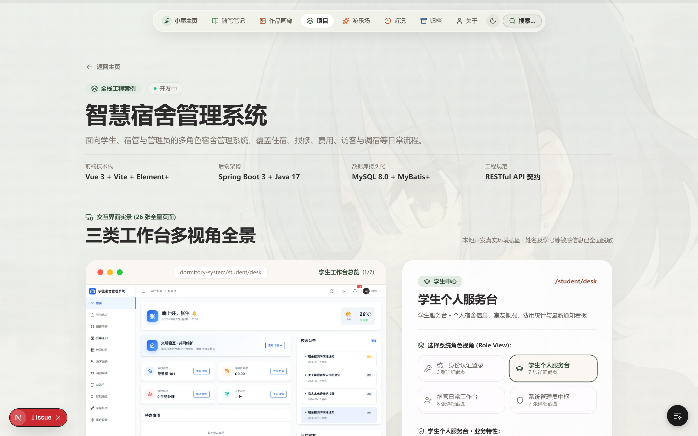

---

### 6. 文章归档系统 (`/archive`)

- **年份纵向时间轴**：按时间倒序清晰梳理每一年的创作轨迹；
- **双重交叉过滤网格**：支持按分类维度（实战/代码/生活/设计）与标签维度（TypeScript/React/CSS/摄影等）毫秒级联动筛选；
- **文章数量实时统计**：直观反馈各个时期的思考沉淀。


---

### 7. 关于小屋与工作台设备清单 (`/about`)

- **站长档案与设计理念**：介绍个人背景、技术信仰与数字小屋的构建初衷；
- **数字工作台与硬件清单**：以杂志卡片形式图文并茂展示开发设备、摄影器材与日常桌面好物；
- **互动留言板（Guestbook）**：访客可留下问候与心声。

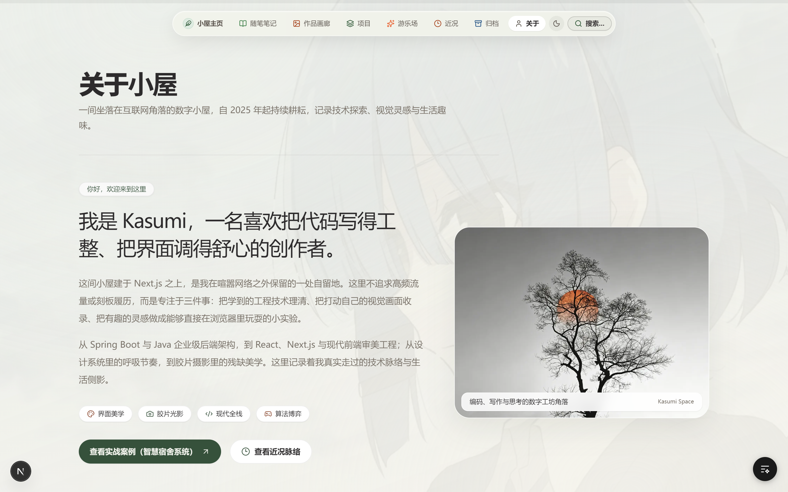

---

### 8. 此刻动态 (`/now`)

- 遵循 **Now Page 运动**理念，记录「当下正在进行的事情」；
- 实时展示当前正在构建的技术栈、正在阅读的书籍、单曲循环的音乐与生活心境碎片。


---

### 9. 全局快捷指令控制台 (`Cmd + K` / `Ctrl + K`)

全站任意页面按下 `Cmd + K`（macOS）或 `Ctrl + K`（Windows）即可唤起全局聚光灯控制台：
- **全局秒级检索**：输入任意关键词即可直达文章、页面或特定小游戏（如输入 `snake` 即可直达贪吃蛇）；
- **深浅色主题切换**：支持深色松木夜间模式与温润浅色宣纸模式无缝切换；
- **全站快捷音效设置**：支持自由开关游戏与按键音效音量。

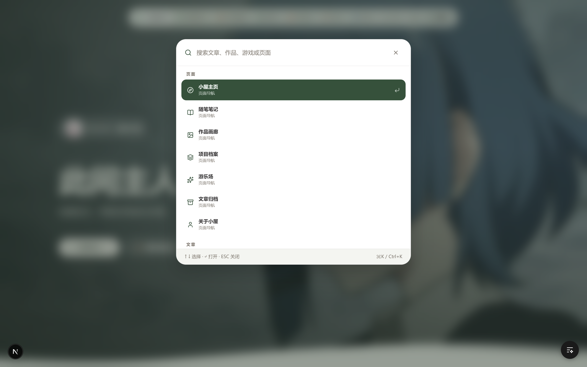

---

## 🛠️ 现代化技术架构矩阵

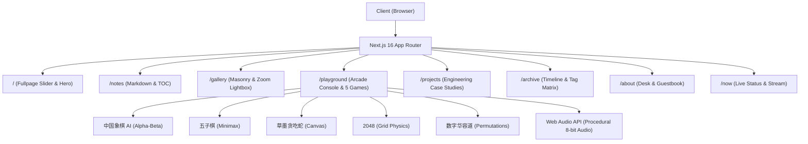

---

## 🚀 快速开始与本地运行

### 1. 环境准备
确保本地已安装 Node.js 18.18+ 或更高版本。

### 2. 克隆与安装依赖
```bash
git clone <repository-url>
cd blog
npm install
```

### 3. 本地开发调试
```bash
npm run dev
```
启动后在浏览器打开 [http://localhost:3000](http://localhost:3000) 即可实时预览。

### 4. 自动化测试与代码体检
```bash
npm test
```
运行全量单元测试（包含文章 Frontmatter 完整性、Web Audio 合成有效性、画廊交互手势算法等 14 项自动化测试）。

### 5. 生产打包与构建
```bash
npm run build
npm run start
```

---

## 📄 版权与声明

- **作者**：Kasumi (Cloud)
- **代码授权**：MIT License
- **文章与插画内容**：除特别注明外，本站所有文字、摄影与原创视觉版权归作者所有。
