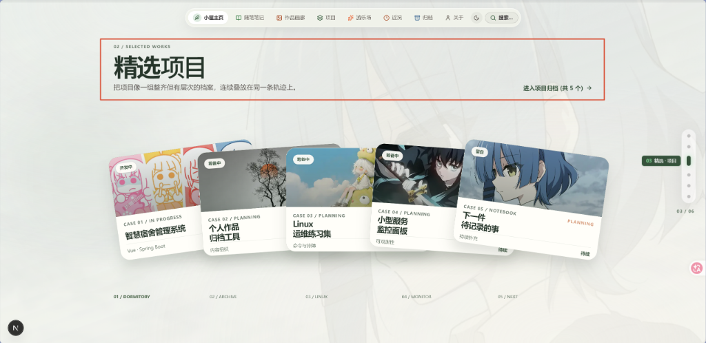
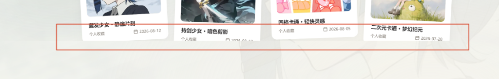
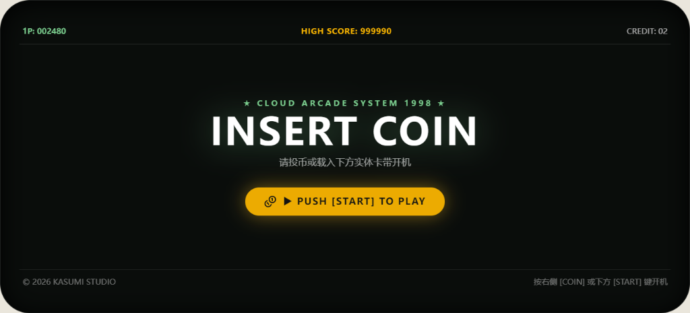
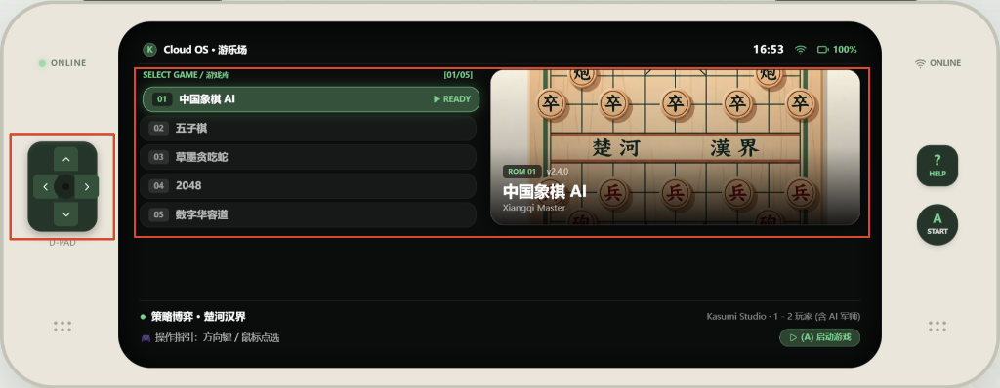
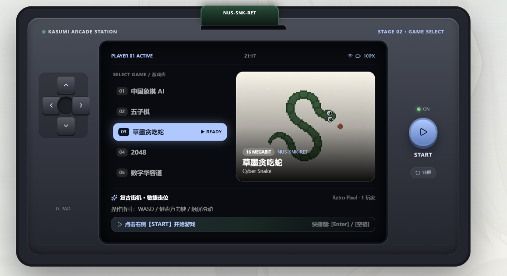
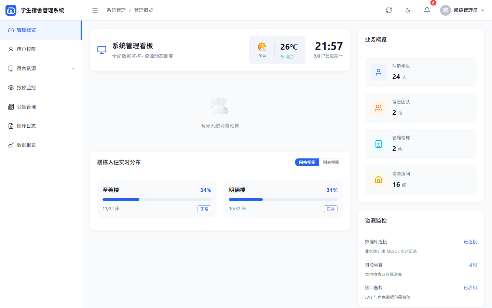

# Kasumi 的数字小屋 · 个人博客架构与功能全景档案

> 静谧、纯粹、反模板化 —— 基于 Next.js 16 与侘寂美学的数字创作空间与掌机游乐场。

---

## 📖 项目简介

**Kasumi 的数字小屋**（Kasumi's Digital Cottage）是一个以「沉静阅读、光影记录、复古灵感」为核心理念的现代化个人全栈博客。不同于常见的模板化 SaaS 仪表盘或喧闹的科技资讯站，本项目遵循东方侘寂（Wabi-Sabi）哲学与编辑部排版风格，融合了现代 Next.js 16 架构与复古掌机交互，为文字随笔、数字画廊与算法小游戏提供了一处高度自洽的栖息地。

### 🌟 核心设计准则

- **自然温润的色彩体系**：主色调选用深松绿（`#36513B`）、砂岩暖白（`#FAF7F2`）与苔原绿（`#7CD090`），配合深色模式下的极简暗夜深松色（`#16231A`）。
- **严格零 Emoji 规范**：全站坚决杜绝任何原生 Emoji 表情，全面采用精致的排版字重层级、物理硬件符号（如 `[ L1 ]`、`▶`）与 Lucide 线性矢量图标，保持专业、冷峻且优雅的高级质感。
- **悬浮拟物与硬件微动效**：悬浮毛玻璃胶囊导航、一体化实体掌机十字方向键、CRT 屏幕微弱噪点、Web Audio 8-bit 程序化无损音效。

---

## 🖼️ 核心功能与页面全景展示

### 1. 首页：全屏平滑滑动与暗调摄影首屏 (`/`)

首页采用纯 CSS 3D Translation 驱动的整页平滑滑动轨道（`FullpageSlider`），告别生硬的吸附式滚动，呈现杂志翻页般的流畅体验。

- **电影级暗调 Hero**：大画幅背景、循环律动的 `TextType` 极简打字机标语与呼吸微光；
- **全站精选聚合**：无缝串联「最新随笔」、「影像画廊」、「工程案例」与「掌机开机舞台」；
- **街机开机待机舞台**：首页底部分栏内嵌掌机开机画面，点击 `START` 可直接唤醒掌机并跳转至游乐场。



---

### 2. 随笔笔记系统 (`/notes`, `/notes/[id]`)

随笔模块是博客的核心思想记录地，专为长文深度阅读与技术复盘量身定制。

- **本地 Markdown / Frontmatter 极速解析**：文章数据完全由本地 Markdown 驱动，零多余网络开销；
- **多维度分类与实时检索**：支持「工程实战」、「代码与思考」、「生活与摄影」、「前端与设计」一键过滤，并配备毫秒级标题/摘要模糊搜索；
- **专业级阅读体验**：文章详情页配备目录自动高亮（TOC）、精确字数与阅读时长预估、语法高亮代码块与平滑返回导航。


---

### 3. 作品画廊系统 (`/gallery`)

画廊是视觉作品与动漫插画的沉浸式展示空间。

- **非对称错落流式瀑布流**：大屏呈现 3 列错落排版，保持每张图片的原始自然比例，拒绝机械的 16:9 硬裁切；
- **100% ~ 300% 交互式平滑缩放查看器**：点开任意作品即可唤起轻量纸质感大图详情窗，支持鼠标滚轮或手势以半级步进无损放大、拖拽平移视口；
- **URL 参数深度直达**：支持 `/gallery?work=<photoId>` 格式的独立直达链接，便于在社交媒体精准分享单个作品。



---

### 4. 灵感掌机与复古街机游乐场 (`/playground`)

游乐场是本博客最具特色、最富趣味的独立交互模块，将复古掌机硬件质感与现代 Web 交互完美结合。

#### 🎮 掌机实体机身外观与控制
- **经典双握把工学外壳**：温润砂岩质感面板搭配深松绿倒角边框；
- **顶部凸起双肩键（L1 / R1）**：支持快速向前/向后切换游戏；
- **左侧握把区**：呼吸状态 LED 指示灯、全新设计的**一体化凹槽十字键（D-PAD）**（支持键盘 `WASD` / `方向键` 同步操控）；
- **右侧握把区**：网络状态标签、实体 `[ ? ] HELP` 指南键与 `(A) START` 确认启动键；
- **底部实体胶囊栏**：提供帮助指南呼出、一键启动与重置待机功能。

#### 📺 OLED 屏幕双重运行状态
1. **待机锁屏模式（Attract Mode）**：
   - 街机经典 HUD 高分榜（`1P: 002480` / `HIGH SCORE: 999990`）；
   - 霓虹待机大标 `★ CLOUD ARCADE SYSTEM 1998 ★` 与呼吸发光开机按钮；
   - 从普通路由直接访问 `/playground` 时自动保持待机锁屏，极具仪式感。
   
   

2. **游戏机运行与选卡模式（Console OS）**：
   - 从主页点击 `START` 时自动带参（`?start=true`）无缝开机直达；
   - **上半部分（左右分栏）**：左侧为整齐舒展的游戏库菜单列表（高亮选中项、`▶ READY` 待命指示灯），右侧为大幅高清游戏封面海报；
   - **下半部分（精炼介绍区）**：清晰陈列游戏玩法分类、开发方、玩家人数与操作指引，内嵌快速启动按钮。

   

#### 🕹️ 5 款内置原创小游戏

| 游戏名称 | 核心技术与算法 | 玩法亮点 |
| :--- | :--- | :--- |
| **中国象棋 AI** | Minimax + Alpha-Beta 剪枝搜索、走法生成器 | 经典楚河汉界棋盘，支持单人挑战 AI 军师与双人本地推演 |
| **五子棋** | 棋盘连珠权值评估矩阵、胜负判定算法 | 极简木纹棋盘，落子声效，支持悔棋与难度切换 |
| **草墨贪吃蛇** | HTML5 Canvas 渲染、自适应 ResizeObserver | 动态渐进式提速机制，碰壁死亡平滑结算遮罩 |
| **2048** | CSS Grid 弹性位移、物理缩放弹跳动画 | 极简配色方块，高分持久化存储，流畅连击消除反馈 |
| **数字华容道** | 逆序数奇偶可解性洗牌算法、绝对定位 Translate 转场 | 保证每次打乱必有解，步数计算器与用时毫秒级秒表 |



#### 🔊 Web Audio 8-bit 程序化音效引擎
全站小游戏音效均采用原生 Web Audio API **实时纯代码合成无损 PCM WAV 音频**，零外部音频文件加载负担，涵盖：
- 投币启动音效（Coin Insert）
- 卡带切换选卡音效（Cartridge Move）
- 落子/移动触觉声（Piece Click）
- 消除得分与胜利欢呼（Victory Chime）

---

### 5. 项目工程实战档案 (`/projects`)

收录站长的全栈开发实战项目，包含深度架构剖析、技术选型演进与真实系统交互演示。

- **案例：高校智慧宿舍管理系统**：
  - 基于 Next.js + Tailwind + Node.js + MySQL 构建的多角色宿舍中枢；
  - 深度展示学生端报修/查房、宿管端出入审核、管理员端全景房源大屏与可视化统计；
  - 配备完整的系统运行真实截图。

| 房源可视化大屏 | 宿舍楼宇房间网格 |
| :---: | :---: |
|  |  |

---

### 6. 文章归档系统 (`/archive`)

- **年份纵向时间轴**：按时间倒序清晰梳理每一年的创作轨迹；
- **双重交叉过滤网格**：支持按分类维度（实战/代码/生活/设计）与标签维度（TypeScript/React/CSS/摄影等）毫秒级联动筛选；
- **文章数量实时统计**：直观反馈各个时期的思考沉淀。

---

### 7. 关于小屋与设备台 (`/about`)

- **站长档案与设计理念**：介绍个人背景、技术信仰与数字小屋的构建初衷；
- **数字工作台与硬件清单**：以杂志卡片形式图文并茂展示开发设备、摄影器材与日常桌面好物；
- **互动留言板（Guestbook）**：访客可留下问候与心声。

---

### 8. 此刻动态 (`/now`)

- 遵循 **Now Page 运动**理念，记录「当下正在进行的事情」；
- 实时展示当前正在构建的技术栈、正在阅读的书籍、单曲循环的音乐与生活心境碎片。

---

### 9. 全局快捷指令控制台 (Command Menu · `Cmd + K`)

全站任意页面按下 `Cmd + K`（macOS）或 `Ctrl + K`（Windows）即可唤起全局聚光灯控制台：
- **全局秒级检索**：输入任意关键词即可直达文章、页面或特定小游戏（如输入 `snake` 即可直达贪吃蛇）；
- **深浅色主题切换**：支持深色松木夜间模式与温润浅色宣纸模式无缝切换；
- **全站快捷音效设置**：支持自由开关游戏与按键音效音量。

---

## 🛠️ 现代化技术架构矩阵

```
┌─────────────────────────────────────────────────────────────┐
│                    Kasumi's Digital Cottage                 │
├─────────────────────────────────────────────────────────────┤
│  Framework      │  Next.js 16.3 (App Router + Turbopack)     │
│  UI Library     │  React 19.2 (RSC + Client Component Pair)  │
│  Language       │  TypeScript (Strict Type Checking)        │
│  Styling        │  Tailwind CSS v4 + Wabi-Sabi Tokens       │
│  Animation      │  GSAP 3 + useGSAP Hardware-Accelerated    │
│  Game Engine    │  HTML5 Canvas + Pure React State Machine  │
│  Audio Engine   │  Web Audio API (Synthesized PCM Audio)    │
│  Data Source    │  Local Markdown + Frontmatter System      │
│  Icons          │  Lucide React Icons (No Emojis)           │
│  Testing        │  Node Test Runner (14/14 Suites Passing)  │
└─────────────────────────────────────────────────────────────┘
```

---

## 🚀 快速开始与本地运行

### 1. 环境准备
确保本地已安装 Node.js 18.18+ 或更高版本。

### 2. 克隆与安装依赖
```bash
git clone <repository-url>
cd blog
npm install
```

### 3. 本地开发调试
```bash
npm run dev
```
启动后在浏览器打开 [http://localhost:3000](http://localhost:3000) 即可实时预览。

### 4. 自动化测试与代码体检
```bash
npm test
```
运行全量单元测试（包含文章 Frontmatter 完整性、Web Audio 合成有效性、画廊交互手势算法等 14 项自动化测试）。

### 5. 生产打包与构建
```bash
npm run build
npm run start
```

---

## 📄 版权与声明

- **作者**：Kasumi (Cloud)
- **代码授权**：MIT License
- **文章与插画内容**：除特别注明外，本站所有文字、摄影与原创视觉版权归作者所有。
