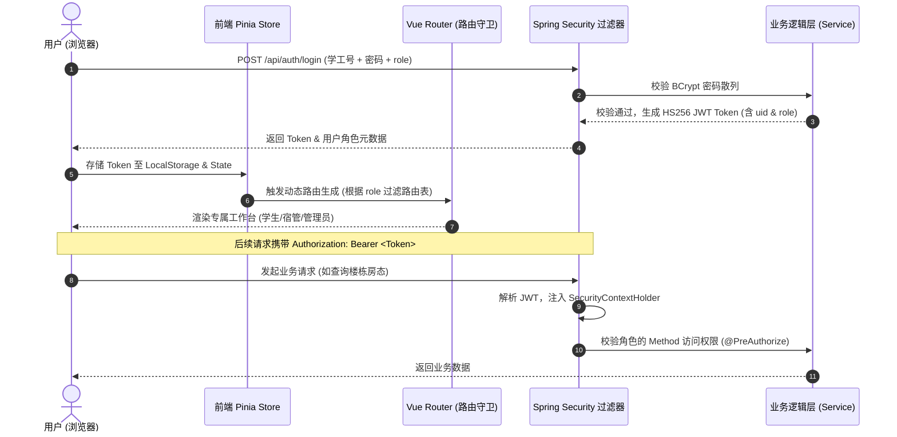

# 从零构建智慧宿舍管理系统：Spring Boot 3 与 Vue 3 的工程化实战与架构权衡

高校宿舍管理是一项典型的多角色、重流程、高并发变动的校园信息化业务。从每学期初的**大规模新生批量入住**、**学期中的调宿与设施损坏报修**，到**每日的外来访客登记与晚归考勤**，传统的纸质台账或单体管理模式极易导致数据孤岛与协同低效。

本文将从需求分析、系统分层架构、RBAC 细粒度权限控制、JWT 无状态双向鉴权到状态机工单流转，深度复盘基于 **Spring Boot 3 + Java 17 + Vue 3 + Element Plus** 构建的智慧宿舍管理系统的工程化落地过程。

---

## 🏛️ 1. 系统总体分层与技术选型

为了保证系统的高内聚低耦合，我们采用了严谨的标准三层架构设计：

```
┌─────────────────────────────────────────────────────────────┐
│ 表现层 (Presentation Layer) - Vue 3 + Vite + Element Plus    │
│ · 动态权限路由 / Pinia 状态管理 / 响应式多端适配 / Axios 拦截器 │
└──────────────────────────────┬──────────────────────────────┘
                               │ RESTful API (JSON / JWT Bearer)
┌──────────────────────────────▼──────────────────────────────┐
│ 业务层 (Service & Security Layer) - Spring Boot 3 + Java 17 │
│ · Spring Security 6 拦截器 / JWT 认证 / 全局异常捕获 / 事务控制 │
└──────────────────────────────┬──────────────────────────────┘
                               │ MyBatis-Plus ORM
┌──────────────────────────────▼──────────────────────────────┐
│ 数据持久层 (Data Layer) - MySQL 8.0                          │
│ · 楼宇床位拓扑 / 核心用户表 / 工单状态审计表 / 索引优化         │
└─────────────────────────────────────────────────────────────┘
```

### 为什么选择 Spring Boot 3 与 Java 17？
1. **Jakarta EE 命名空间升级与虚拟线程准备**：基于 Spring Boot 3 享受最新的框架性能与安全基准；
2. **RESTful 契约统一**：通过统一响应体 `R<T>`、全局错误码枚举 `ResultCode` 与统一异常拦截器 `@RestControllerAdvice`，实现严格的 API 契约；
3. **MyBatis-Plus 高效 CRUD**：在单表基础操作上零 SQL 编码，在多表统计与图表聚合查询中使用 XML 手写优化 SQL。

---

## 🛡️ 2. RBAC 细粒度权限模型与 JWT 双向鉴权

系统涵盖 **学生 (Student)**、**宿管 (Manager)** 与 **系统管理员 (Admin)** 三类完全不同的用户群体，权限边界的隔离是系统的生命线。

### 2.1 鉴权拦截流转时序



### 2.2 JWT 拦截器核心实现代码

在后端通过自定义 `JwtAuthenticationFilter` 对每个 HTTP 请求进行无状态解析：

```java
@Component
public class JwtAuthenticationFilter extends OncePerRequestFilter {

    @Autowired
    private JwtUtils jwtUtils;

    @Override
    protected void doFilterInternal(HttpServletRequest request, 
                                    HttpServletResponse response, 
                                    FilterChain filterChain) throws ServletException, IOException {
        String authHeader = request.getHeader("Authorization");

        if (StringUtils.hasText(authHeader) && authHeader.startsWith("Bearer ")) {
            String token = authHeader.substring(7);
            if (jwtUtils.validateToken(token)) {
                Claims claims = jwtUtils.getClaimsFromToken(token);
                String username = claims.getSubject();
                String role = claims.get("role", String.class);

                // 构建 Spring Security 权限实体
                List<GrantedAuthority> authorities = List.of(new SimpleGrantedAuthority("ROLE_" + role));
                UsernamePasswordAuthenticationToken authentication = 
                    new UsernamePasswordAuthenticationToken(username, null, authorities);
                
                SecurityContextHolder.getContext().setAuthentication(authentication);
            }
        }
        filterChain.doFilter(request, response);
    }
}
```

---

## ⚙️ 3. 报修业务 5 节点状态机审批流

报修是宿舍日常最高频的交互场景。为了防止工单流转出现状态倒流或悬挂，我们设计了严格的状态机流转模型：

| 当前状态 | 触发动作 (Event) | 目标状态 | 操作角色 | 业务副作用 |
|---|---|---|---|---|
| **待审核 (PENDING)** | 宿管审核并派工 | **已派单 (ASSIGNED)** | 宿管员 | 记录派单师傅姓名与指派时间 |
| **已派单 (ASSIGNED)** | 师傅接单上门 | **维修中 (PROCESSING)** | 维修工/宿管 | 触发学生端进度提醒 |
| **维修中 (PROCESSING)** | 师傅完工申报 | **已完成 (COMPLETED)** | 维修工 | 记录工单耗时与配件费用 |
| **已完成 (COMPLETED)** | 学生验收打分 | **已归档 (ARCHIVED)** | 学生 | 记录星级评分与文字反馈 |
| **待审核 (PENDING)** | 信息不符驳回 | **已驳回 (REJECTED)** | 宿管员 | 填写驳回原因并通知学生 |

---

## 📊 4. 房态图谱与床位空闲算法优化

在宿管和管理员端，如何直观展示**整栋楼宇数十个房间的实时入住率与空余床位**是一个核心前端难点。

我们设计了基于房间状态的即时颜色映射与动态网格布局：
- **绿色 (Green)**：完全空闲 (0 人入住)；
- **蓝色 (Blue)**：部分入住 (如 4 人间已有 2 人)；
- **琥珀色 (Amber)**：满员满宿 (4/4 人)；
- **灰色 (Gray)**：维护锁定或预留床位。

配合 Element Plus 虚拟滚动与防抖筛选，在渲染 500+ 房间列表时依然保持 60fps 丝滑滚动体验。

---

## 🎯 5. 工程复盘与思考

1. **前后端类型契约的统一**：通过 TypeScript Interface 与 Java DTO 保持完全镜像，消除了前后端联调时的字段类型隐患；
2. **细粒度数据脱敏**：在全校大盘展示与访客记录中，对学生身份证号、手机号统一使用脱敏掩码 (`138****1234`)，保障个人隐私安全；
3. **无缝的用户体验**：通过左右双栏联动画廊与画廊级深色灯箱缩放，让复杂的工程系统以最高颜值的形式对外呈现。

---

> 💡 **项目结语**：
> 一个优秀的管理系统不仅在于功能的完备，更在于架构设计的严谨性、状态流转的自洽性与交互界面的克制之美。
